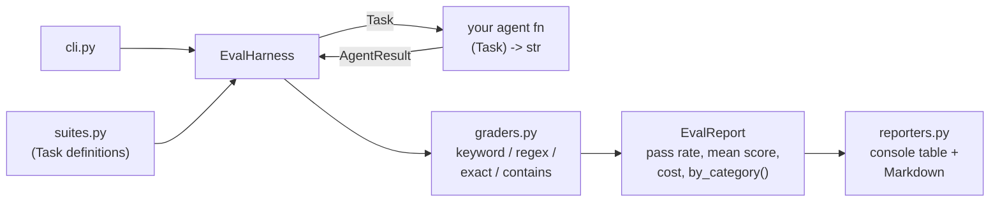

# agent-eval-harness

A tiny, dependency-free **evaluation harness for LLM coding agents**. Define tasks, plug in any agent function, get pass rates, per-category breakdowns, cost tracking, and Markdown reports — in under a minute.

## Why this exists

When you iterate on an agent (better prompts, new tools, a different model), you need a fast answer to *"did it get better or worse?"* Full eval platforms are heavy. This harness is ~200 lines: no server, no database, no API keys required to try it.

## Quick start

```bash
git clone https://github.com/sulaimanvesal/agent-eval-harness
cd agent-eval-harness
python -m agent_eval.cli --suite builtin
# add --markdown report.md to also write a Markdown report
```

Sample output:

```
Eval report run-3f9a1c2e
pass rate 100%   mean score 1.00   cost $0.0000

task              cat       grade score  details
py-reverse        coding    PASS  1.00   all keywords present
sql-top-n         coding    PASS  1.00   all keywords present
regex-email       coding    PASS  1.00   pattern matched
capital-france    qa        PASS  1.00   found substring 'Paris'
sum-formula       reasoning PASS  1.00   exact match
json-schema       coding    PASS  1.00   pattern matched
```

## Bring your own agent

```python
from agent_eval.harness import EvalHarness
from agent_eval.reporters import to_console
from agent_eval.suites import builtin_suite

def my_agent(task):
    # call your LLM / agent framework here; return the output string
    return call_my_llm(task.prompt)

report = EvalHarness(agent=my_agent, tasks=builtin_suite(),
                     max_retries=2, cost_per_call_usd=0.002).run()
print(to_console(report))
```

See [`examples/custom_agent.py`](examples/custom_agent.py).

## Defining tasks

```python
from agent_eval.models import Task

Task(
    id="py-reverse",
    prompt="Write a Python function `reverse_words(s)`...",
    category="coding",            # any label; reported per-category
    difficulty="easy",
    reference="Paris",            # expected answer (for contains/exact graders)
    metadata={
        "grader": "keyword",      # keyword | regex | exact | contains
        "keywords": ["def reverse_words", "split", "join"],
        # "pattern": r"...",      # for the regex grader
    },
)
```

## Architecture



### Components

| Module | Responsibility |
|---|---|
| `models.py` | `Task`, `AgentResult`, `TaskScore`, `EvalReport` dataclasses + aggregate stats |
| `harness.py` | Runs each task through your agent fn, times it, retries on error/empty output, tracks cost |
| `graders.py` | Four deterministic graders (`keyword`, `regex`, `exact`, `contains`) selected per task |
| `suites.py` | Built-in 6-task suite (coding / QA / reasoning); `load_suite(name)` registry for your own |
| `reporters.py` | Console table and Markdown report with per-category breakdown |
| `cli.py` | `python -m agent_eval.cli` entry point with a scripted demo agent (no API key needed) |

## Design notes

- **Agents are just functions** `(Task) -> str`. No framework lock-in — wrap LangChain, CrewAI, raw API calls, anything.
- **Grading is deterministic.** LLM-as-judge is powerful but flaky and expensive; keyword/regex/exact/contains cover most coding-task checks reproducibly.
- **Failures never kill a run.** Exceptions and empty outputs are recorded as failed tasks with the error attached, and retried up to `max_retries`.
- **Cost is first-class.** Pass `cost_per_call_usd` and the report totals spend per run — useful when comparing models.

## Roadmap ideas

- LLM-as-judge grader (with caching), parallel task execution, JSONL task-suite loader, diff-based patch grader, CI badge workflow.

## License

MIT — see [LICENSE](LICENSE).
